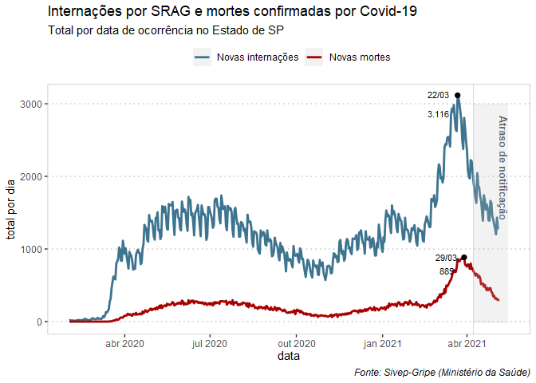
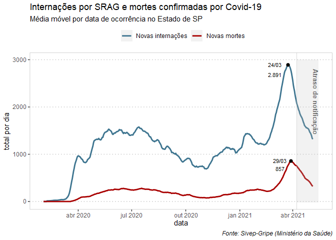
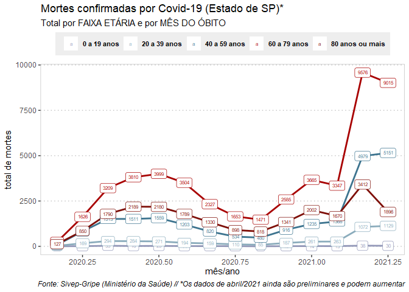

Análises do Sivep-Gripe (até 10/05/2021)
================
(Por Ana Carolina Moreno)
Relatório gerado em 13/05/2021 com dados atualizados até 10/05

<!-- README.md is generated from README.Rmd. Please edit that file -->

###### Fonte: Sivep-Gripe (Ministério da Saúde): [link para o OpenDatasus](opendatasus.saude.gov.br/)

<!-- badges: start -->
<!-- badges: end -->

Essa página contém análises de dados de casos confirmados de Covid-19 no
Estado de São Paulo.

    #> [1] "png"

#### 1- TOTAL de internações e mortes por dia

-   Linha vermelha: internações
-   Linha verde: mortes
-   Entre meados de março e o início de abril o Estado de SP registrou
    pelo menos 2 mil novos pacientes internados por dia; o pico atual é
    3.116 em 22/03 (desde a atualização anterior esse número aumentou
    marginalmente)
-   Já as mortes ficaram pelo menos acima de 500 por dia no período; o
    pico atual é 885 mortes ocorridas em 29/03 (o valor da atualização
    anterior era 859 mortes nesse dia)
-   O gráfico dá indícios de que existe uma relação entre o aumento da
    pressão no sistema hospitalar provocou também um aumento do risco de
    morrer pela doença

(A área cinza indica a partir de quando os dados caem devido ao atraso
de notificação, e ainda podem sofrer grandes mudanças nas próximas
semanas)

``` r
plot(ggplot_covid_sp_dia)
```

<!-- -->

[Download da tabela em
CSV](https://github.com/anacarolinamoreno/Analises_Sivep_2021-05-10/docs/covid_sp_dia_absoluto.csv)
\| [Download da arte em
SVG](https://github.com/anacarolinamoreno/Analises_Sivep_2021-05-10/docs/grafico_covid_sp_dia_totalabsoluto.svg)

#### 2- MÉDIA MÓVEL de internações e mortes por dia

-   Linha vermelha: internações
-   Linha verde: mortes
-   O gráfico é o mesmo acima, mas está mais suavizado porque representa
    a média móvel de 7 dias
-   O pico atual da média de internações segue sendo 24/03, com 2.852.
-   O pico da média de mortes é 29/03, com 838 mortes diárias.

(A área cinza indica a partir de quando os dados caem devido ao atraso
de notificação, e ainda podem sofrer grandes mudanças nas próximas
semanas)

``` r

plot(ggplot_covid_sp_dia_media)
```

<!-- -->

[Download da tabela em
CSV](https://github.com/anacarolinamoreno/Analises_Sivep_2021-05-10/docs/covid_sp_dia_media_movel.csv)
\| [Download da arte em
SVG](https://github.com/anacarolinamoreno/Analises_Sivep_2021-05-10/docs/grafico_covid_sp_dia_mediamovel.svg)

#### 3- MORTES por Covid por MÊS e por FAIXA ETÁRIA

-   Na atualização de 10/05 da Sivep, os dados de abril ainda são
    preliminares e, portanto, estão sujeitos a alterações, muito
    provavelmente para cima.
-   No entanto, já é possível notar uma importante tendência: entre as
    faixas etárias de 40 a 59 anos, e de 20 a 39 anos, já existem mais
    mortes ocorridas em abril do que em março.
-   Entre as duas faixas etárias de idosos (60 a 79 anos, e 80 anos ou
    mais), por enquanto abril ainda tem menos mortes registradas do que
    março.
-   É possível que, para a faixa de 60 a 79 anos, isso ainda possa
    mudar, já que o total preliminar de abril já se aproxima do total de
    março, e os dados de abril só devem estar mais consolidados no
    início de junho.
-   No entanto, entre as pessoas com 80 anos ou mais, o número de mortes
    ocorridas em abril é muito menor (até agora) do que o de março.

``` r
plot(ggplot_obitos_covid_sp_idade_20)
```

<!-- -->

[Download da tabela em
CSV](https://github.com/anacarolinamoreno/Analises_Sivep_2021-05-10/docs/obitos_covid_sp_mes_idade.csv)
\| [Download da arte em
SVG](https://github.com/anacarolinamoreno/Analises_Sivep_2021-05-10/docs/grafico_obitos_covid_sp_idade_20.svg)
